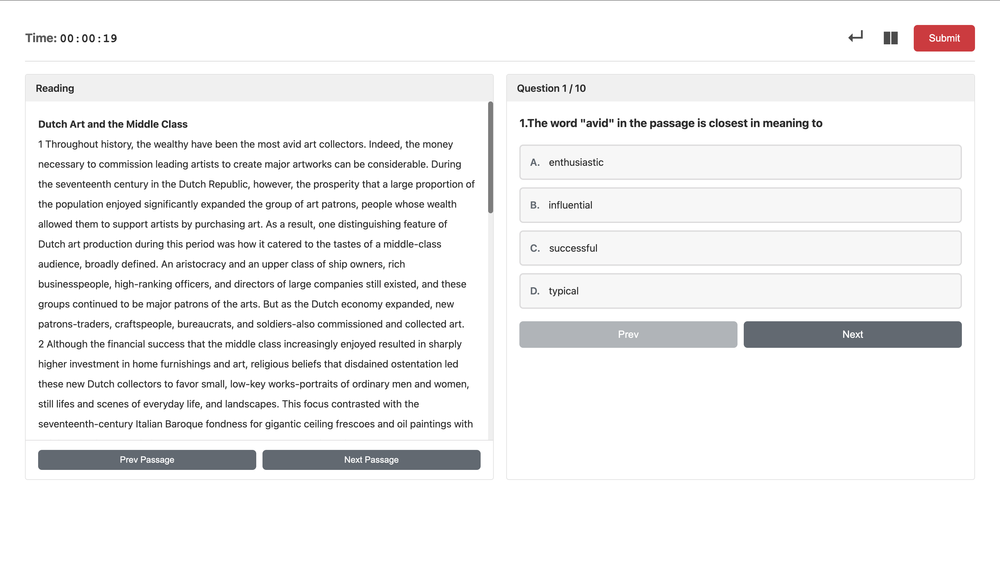
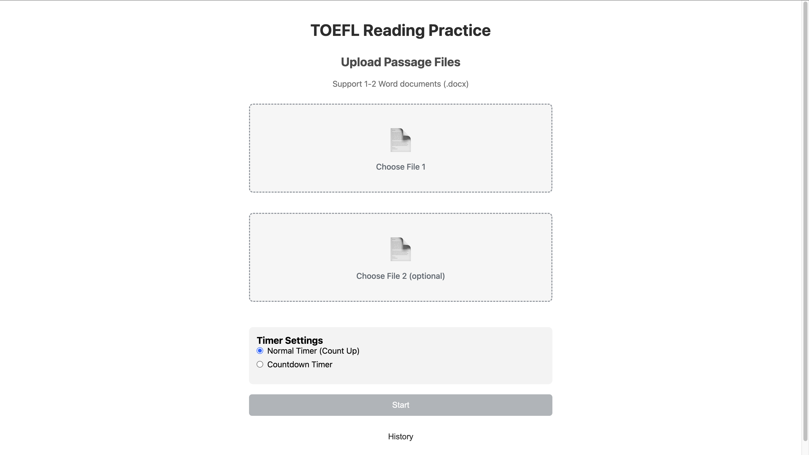

# TOEFL Reading Simulation Exam System

A web application for simulating the TOEFL reading exam. Supports uploading Word documents and automatically parsing questions.

## Features

- 📄 **Document Upload**: Supports uploading 1-2 Word documents (`.docx` format)
- 🔍 **Automatic Parsing**: Automatically detects reading passages and questions, and intelligently splits content
- 📝 **Exam Interface**: Dual-column layout with reading passage on the left and questions/options on the right
- ⏱️ **Timer**: Real-time display of exam time
- 📊 **Result Review**: View all answers and results after submission

## Screenshots

*Figure 1: Screenshot of the TOEFL Reading Simulation Exam System interface, showing the dual-column layout with reading passage and questions.*

*Figure 2: Screenshot of the home page, showing the document upload interface.*

## How to Use

1. Right-click on `index.html` and open with Live Server (or use another local server extension in your editor)
2. Click the "Choose Document" button to upload a Word document (`.docx` format supported)
3. Optionally, upload a second document
4. Click the "Start Exam" button to enter the answering interface
5. Select answers on the right, and use the "Previous"/"Next" buttons to navigate
6. After finishing, click "Submit" to view your results

## Document Format Requirements

- File format: `.docx` (Word 2007 or later)
- Structure:
  - Reading passage comes first
  - Questions start from the first occurrence of "A. ", "B. ", "C. ", or "D. "
  - Question numbering can be `1. `, `1) `, or `(1) `
  - Option format: `A. `, `B. `, `C. `, `D. ` or `A) `, `B) `, `C) `, `D) `

## Technical Details

- Uses the `mammoth.js` library to parse Word documents
- Pure front-end implementation, no server required
- Responsive design, supports various screen size

## Notes

- Ensure the Word document format is correct and options are clearly marked
- Parsing depends on document formatting; if parsing fails, please check your document format
- Chrome is recommended for the best experience

**If this project helps you, please ⭐ star and fork it!**

